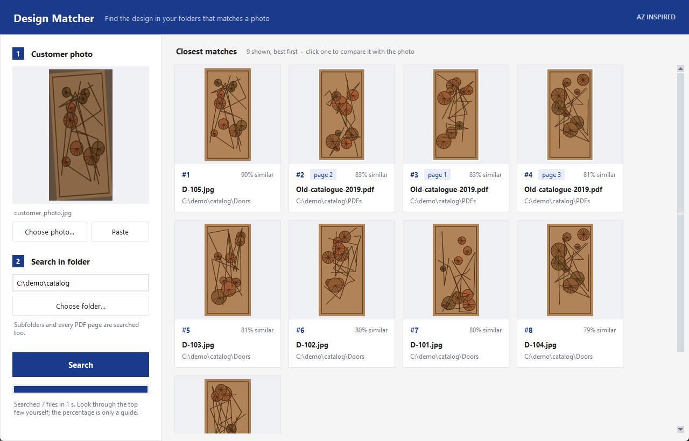
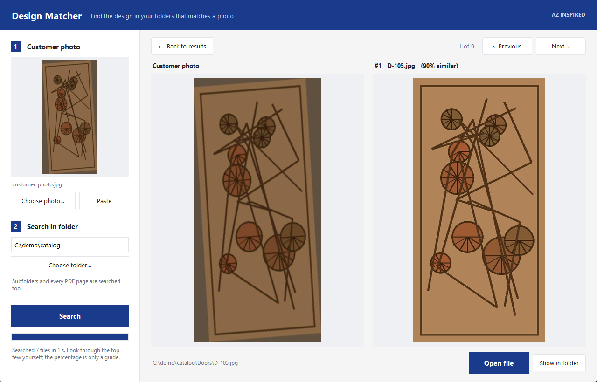

# Design Matcher

**Forgot where you saved that design? Search your folders by picture instead of by file name.**

Give the app a photo and a folder. It looks through every image **and every page of every PDF** in that folder and all its subfolders, and shows the closest designs as a grid of pictures, best first. Click one to see it side by side with your photo.

Useful for designers and workshops with thousands of designs, catalogues and images scattered across folders and PDFs, where file names like `IMG_0042.jpg` don't tell you anything.



*The photo on the left, the closest designs on the right, including matching pages inside a PDF catalogue.*



*Click a result to compare it with the photo, then open the file or show it in its folder.*

### What it can do

- Match a phone photo of a finished piece against catalogue images and renders, even when the wood colour, lighting and framing differ
- Search images (JPG, PNG, WEBP, BMP, TIFF, GIF) and PDFs page by page, and show which page matched
- Search a whole folder tree, including subfolders
- Paste a photo straight from WhatsApp or a browser with Ctrl+V
- Remember what it has already looked at, so only the first search of a big folder is slow
- Run fully offline on a normal PC: no GPU, no account, nothing uploaded

Built for CNC and woodcarving shops: a customer sends a phone photo of a carved door, and you need to find the matching design file among thousands. In a test with a real customer photo against 3,063 files of door designs (6,716 images and PDF pages), the top 5 results were all the matching design, saved in four different places.

## Download (Windows, no Python needed)

1. Go to the [latest release](https://github.com/anshusingh51/image-match-search-windows/releases/latest)
2. Download **DesignMatcher.exe**
3. Double-click it

The file is about 80 MB because it carries its own copy of Python and the image-matching model. Nothing is installed and nothing leaves your PC.

Windows may show a blue "Windows protected your PC" screen the first time, because the exe is not code-signed (that costs money each year). Click **More info**, then **Run anyway**. If Smart App Control is turned on (Windows Security > App & browser control), Windows blocks unsigned apps outright with no Run anyway option; use the Python version below instead. Some antivirus programs also flag any unsigned single-file exe made this way. If you prefer not to trust a downloaded exe, run it from source instead (below) and read the code; it is three short Python files.

## Speed

The first search of a folder reads every file: about 10 minutes for 3,000 files (6,700 images and pages) on a 6-core desktop. After that only new or changed files are read, and a repeat search of the same folder took about 1 second.

What it has read is kept in `%LOCALAPPDATA%\DesignMatcher`. Delete that folder to start fresh.

## Run from source (Python)

Requires Python 3.9+ (Tkinter is included with the standard Windows Python installer).

```
pip install -r requirements.txt
```

Desktop app:

```
python design_matcher_app.py
```

Command line:

```
python find_matching_design.py customer_photo.jpg "C:\path\to\designs" --top 30
```

## How it works

Each image is described by DINOv2, a small image-recognition model from Meta AI, run on the CPU with ONNX Runtime. It looks at three squares along the length of the design (top, middle and bottom) and compares each with the same part of your photo. That picks up the shapes of the design rather than wood grain or colour, which is how a photo of a finished door can find its catalogue render.

The percentage is the average similarity of the three squares. Treat it as a guide and look through the top few results yourself.

`--mode hash` in the command-line tool is a separate, fast mode for finding exact duplicates (resized or re-saved copies of the same file).

## Credits and licence

The app code is MIT licensed.

The bundled model, `models/dinov2-small-quantized.onnx`, is [DINOv2 small](https://huggingface.co/facebook/dinov2-small) by Meta AI, licensed under Apache 2.0, in the quantized ONNX conversion from [Xenova/dinov2-small](https://huggingface.co/Xenova/dinov2-small). See [models/LICENSE-dinov2.txt](models/LICENSE-dinov2.txt).
